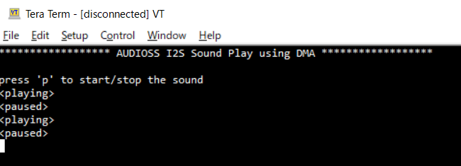

# AUDIOSS I2S Sound Play using DMA

**This code example shows how to play the sound of WAV format via I2S functionality of AUDIO Subsystem using P-DMA**  

## Device

The device used in this code example (CE) is:

- [TRAVEO™ T2G CYT4BF Series](https://www.infineon.com/cms/en/product/microcontroller/32-bit-traveo-t2g-arm-cortex-microcontroller/32-bit-traveo-t2g-arm-cortex-for-body/traveo-t2g-cyt4bf-series/)

## Board

The board used for testing is:

- TRAVEO™ T2G evaluation kit ([KIT_T2G-B-H_EVK](https://www.infineon.com/cms/en/product/evaluation-boards/kit_t2g-b-h_evk/), [KIT_T2G-B-H_LITE](https://www.infineon.com/cms/en/product/evaluation-boards/kit_t2g-b-h_lite/))

## Scope of work
TRAVEO™ T2G MCUs have an Audio Subsystem that can establish a serial bus interface used to connect digital audio device together. This CE transmits a WAV sound source prepared in Code Flash via standard I2S bus. In addition, the sound can be played without any CPU load since the CPU only used to input a trigger to start playing the sound and the sound data transmission is done automatically by P-DMA.

## Introduction  

**AUDIO Subsystem**  

- Supports standard I2S, LJ, and eight-channel TDM digital audio interface formats
- Supports both master and slave mode operation in all the digital audio formats
- Supports independent operation of Receive (RX) and Transmit (TX) directions
- Supports operating from an external master clock provided through an external IC such as audio codec
- Provides configurable clock divider registers to generate the required sample rates
- Supports data word length of 8-bit, 16-bit, 18-bit, 20-bit, 24-bit, and 32-bit per channel
- Supports channel length of 8-bit, 16-bit, 18-bit, 20-bit, 24-bit, and 32-bit per channel (channel length fixed at 32-bit in TDM format)
- Provides two hardware FIFO buffers, one each for the TX block and RX block, respectively
- Supports both DMA- and CPU-based data transfers

**Peripheral DMA (P-DMA)**  
The MCU has two types of DMA, P-DMA and M-DMA. P-DMA is used to transfer data between memory and peripherals without CPU involvement: the CPU configures/programs the P-DMA but the actual transfer is done by the P-DMA controller. The primary design target is P-DMA functionality at limited
area overhead to the platform. Functionally, the P-DMA controller is similar to a general-purpose DMA controller. 
<table border="1" style="border-collapse: collapse">
<thead><tr>
<th>Feature</th><th>P-DMA</th><th>M-DMA</th></tr></thead>
<tbody>
<tr><td><code>Focus</code></td><td>Low latency</td><td>High memory bandwidth</td></tr>
<tr><td><code>Used for</code></td><td>Transfer between peripheral and memory</td><td>Transfer between memories</td></tr>
<tr><td><code>Transfer engine</code></td><td>Shared between all channels</td><td>Dedicated for each channel</td></tr>
<tr><td><code>Transfer size</code></td><td colspan="2">8-bit/16-bit/32-bit</td></tr>
<tr><td><code>Channel priority</code></td><td>Four levels, Preemptable</td><td>Four levels</td></tr>
<tr><td><code>Transfer mode</code></td><td>Single 1D/2D CRC transfer</td><td>Single 1D/2D Memory copy Scatter</td></tr>
<tr><td><code>Descriptor</code></td><td colspan="2">Source and destination address Transfer size Channel action Data transfer mode Activation trigger type (4 types) Output trigger type (4 types) Interrupt type (4 types) Descriptor chaining</td></tr>
<tr><td><code>Access-control attributes</code> <i>The access attributes of the bus transfer that programmed the channel will be inherited</i></td><td colspan="2">Privileged/Unprivileged Secure/Non-secure Protection contexts</td></tr>
</tbody>
</table>

More details can be found in [Technical Reference Manual (TRM)](https://www.infineon.com/dgdl/?fileId=5546d4627600a6bc017600bfae720007), [Registers TRM](https://www.infineon.com/dgdl/?fileId=5546d4627600a6bc017600be2aef0004) and [Data Sheet](https://www.infineon.com/dgdl/?fileId=5546d46275b79adb0175dc8387f93228).

## Hardware setup

This CE has been developed for:
- TRAVEO™ T2G evaluation kit ([KIT_T2G-B-H_EVK](https://www.infineon.com/cms/en/product/evaluation-boards/kit_t2g-b-h_evk/)) 
 
No changes are required from the board's default settings.
 Output signals are output from the following pins respectively: 
     <table border="1" style="border-collapse: collapse">
     <thead><tr>
     <th>Tx Serial Clock (SCK)</th><th>Tx Word Select (WS)</th><th>Tx Serial Data (SD)</th></tr></thead>
     <tbody>
     <tr><td>P11[1]</td><td>P11[2]</td><td>P12[0]</td></tr>
     </tbody>
     </table>

- TRAVEO™ T2G Body High Lite evaluation kit ([KIT_T2G-B-H_LITE](https://www.infineon.com/cms/en/product/evaluation-boards/kit_t2g-b-h_lite/)) 
 
No changes are required from the board's default settings.
 Output signals are output from the following pins respectively: 
     <table border="1" style="border-collapse: collapse">
     <thead><tr>
     <th>Tx Serial Clock (SCK)</th><th>Tx Word Select (WS)</th><th>Tx Serial Data (SD)</th></tr></thead>
     <tbody>
     <tr><td>P13[1]</td><td>P13[2]</td><td>P13[3]</td></tr>
     </tbody>
     </table>

## Implementation

**I2S waveform**  

The figure below shows the timing diagrams for the different word
length on 32-bit channel length in the standard I2S digital audio format:  
Channel length and word length can be selected according to the requirements of the target module. This CE uses 16-bit word length on 32-bit channel length. The configuration is done in *setup_Sound()* function by calling <a href="https://infineon.github.io/mtb-pdl-cat1/pdl_api_reference_manual/html/group__group__i2s__functions.html#ga7574dd2c887d3a97a9e4ffae4c586cf6"><i>Cy_I2S_Init()</i></a> with the configuration structure generated by Device Configurator:  

**P-DMA configuration**  

In this CE, P-DMA is used to transferring WAV data onto TX_FIFO of I2S function. The P-DMA transfer must be configured by descriptor(s) that P-DMA can interpret. The figure below outlines the structure of the P-DMA descriptor group provided for WAV transfer to I2S:  
In the *prepare_Dw_Descriptor_Stereo()* function called by *setup_Sound()*, multiple descriptors will be dynamically created based on the size of the WAV to be transferred. The maximum transferable count of word by single descriptor is 65536 by using 2D transfer, where x and y value are both 256. So this function configures descriptors as this maximum length until the rest size of WAV data becomes less than it. After that the remaining data configured to be transferred by descriptor(s) which x and y is specified as the rest size. These descriptors configured as to chain to next one sequentially, and the last descriptor chained to top descriptor. This descriptor chain realizes endless playback of WAV data without any CPU load. These configured descriptors are set to P-DMA hardware by using <a href="https://infineon.github.io/mtb-pdl-cat1/pdl_api_reference_manual/html/group__group__dma__descriptor__functions.html#gab1610fab6f2dd5fd25c031ac0aa9d8cb"><i>Cy_DMA_Descriptor_Init()</i></a> function. Note that the function *SCB_CleanDCache()* should be called after these descriptors preparation to clean up the D-cache since the P-DMA controller also read the descriptors.

Then the *setup_Sound()* function initializes P-DMA by calling <a href="https://infineon.github.io/mtb-pdl-cat1/pdl_api_reference_manual/html/group__group__dma__channel__functions.html#gab0beed3c05362206ac66fc4327d8964b"><i>Cy_DMA_Channel_Init()</i></a>, then enables the P-DMA by calling <a href="https://infineon.github.io/mtb-pdl-cat1/pdl_api_reference_manual/html/group__group__dma__channel__functions.html#ga13e6923cafe660ba825ba6d5b1841bf7"><i>Cy_DMA_Channel_Enable()</i></a> and <a href="https://infineon.github.io/mtb-pdl-cat1/pdl_api_reference_manual/html/group__group__dma__block__functions.html#gad14b53935dc8321f395e49a7dfec2c5a"><i>Cy_DMA_Enable()</i></a>. Next it call <a href="https://infineon.github.io/mtb-pdl-cat1/pdl_api_reference_manual/html/group__group__trigmux__functions.html#gab7106b8fe037e2ebbbb996289ad1fb00"><i>Cy_TrigMux_Select()</i></a> to configure the P-DMA channel to be triggered by the I2S channel.

**Miscellaneous settings**  

- **STDIN / STDOUT setting**

  - Calling <a href="https://infineon.github.io/retarget-io/html/group__group__board__libs.html#ga21265301bf6e9239845227c2aead9293"><i>cy_retarget_io_init()</i></a> function to use UART as STDIN / STDOUT
    - Initialize the port defined as *CYBSP_DEBUG_UART_TX* as UART TX, defined as *CYBSP_DEBUG_UART_RX* as UART RX (these pins are connected to KitProg3 COM port)
    - The serial port parameters become to 8N1 and 115200 baud

  - The UART receiving interrupt is configured in the <a href="https://infineon.github.io/mtb-hal-cat1/html/group__group__hal__uart.html#ga4dae4cef7dbf1d7935fe6dd6d31f282e"><i>cyhal_uart_enable_event()</i></a> function

    - When the command is received through the terminal, interrupt occur and it controls the sound playback by *process_Key_Press()*.

    - The callback routine is prepared as *handle_UART_Event()* and is registered by the <a href="https://infineon.github.io/mtb-hal-cat1/html/group__group__hal__uart.html#gae26bab64811713b1d69170352fe32c20"><i>cyhal_uart_register_callback()</i></a> function, it will be call backed from the driver by calling <a href="https://infineon.github.io/mtb-hal-cat1/html/group__group__hal__uart.html#ga00ef108f7ee7beba3d5090b2e506b54f"><i>cyhal_uart_read_async()</i></a> if some data is received and available.

- **Sound playback control**  

  - When the *main()* function detects that `p` is input on terminal, it pauses and also restarts the sound playback. These operations are done in functions *stop_Sound()* and *start_Sound()*, they realize their functionality by disabling / enabling the I2S channel by calling <a href="https://infineon.github.io/mtb-pdl-cat1/pdl_api_reference_manual/html/group__group__i2s__functions.html#ga732b71093031a588f2a06d65721e5833"><i>Cy_I2S_DisableTx()</i></a> and <a href="https://infineon.github.io/mtb-pdl-cat1/pdl_api_reference_manual/html/group__group__i2s__functions.html#ga7d690f4d128200b3c027fd07d8bcf972"><i>Cy_I2S_EnableTx()</i></a>.

## Run and Test

For this CE, a terminal emulator is required for displaying outputs and get inputs. Install a terminal emulator if you do not have one. Instructions in this document use [Tera Term](https://ttssh2.osdn.jp/index.html.en).

After code compilation, perform the following steps to flashing the device:

1. Connect the board to your PC using the provided USB cable through the KitProg3 USB connector.
2. Open a terminal program and select the KitProg3 COM port. Set the serial port parameters to 8N1 and 115200 baud.
3. Program the board using one of the following:
    - Select the CE project in the Project Explorer.
    - In the **Quick Panel**, scroll down, and click **[Project Name] Program (KitProg3_MiniProg4)**.
4. After programming, the CE starts automatically. Confirm that the messages are displayed on the UART terminal.

    - *Terminal output on program startup* 

5. You can debug the example to step through the code. In the IDE, use the **[Project Name] Debug (KitProg3_MiniProg4)** configuration in the **Quick Panel**. For details, see the "Program and debug" section in the [Eclipse IDE for ModusToolbox™ software user guide](https://www.infineon.com/dgdl/?fileId=8ac78c8c8386267f0183a8d7043b58ee).

**Note:** **(Only while debugging)** On the CM7 CPU, some code in *main()* may execute before the debugger halts at the beginning of *main()*. This means that some code executes twice: once before the debugger stops execution, and again after the debugger resets the program counter to the beginning of *main()*. See [KBA231071](https://community.infineon.com/t5/Knowledge-Base-Articles/PSoC-6-MCU-Code-in-main-executes-before-the-debugger-halts-at-the-first-line-of/ta-p/253856) to learn about this and for the workaround.

## References  

Relevant Application notes are:

- AN235305 - GETTING STARTED WITH TRAVEO™ T2G FAMILY MCUS IN MODUSTOOLBOX™
- [AN226043](https://www.infineon.com/dgdl/?fileId=8ac78c8c7cdc391c017d0d3e9ceb67ee) - How to Use Sound Subsystem in Traveo II Family
- [AN220191](https://www.infineon.com/dgdl/?fileId=8ac78c8c7cdc391c017d0d3aee0b678a) - How to use direct memory access (DMA) controller in TRAVEO™ II family

ModusToolbox™ is available online:
- <https://www.infineon.com/modustoolbox>

Associated TRAVEO™ T2G MCUs can be found on:
- <https://www.infineon.com/cms/en/product/microcontroller/32-bit-traveo-t2g-arm-cortex-microcontroller/>

More code examples can be found on the GIT repository:
- [TRAVEO™ T2G Code examples](https://github.com/orgs/Infineon/repositories?q=mtb-t2g-&type=all&language=&sort=)

For additional trainings, visit our webpage:  
- [TRAVEO™ T2G trainings](https://www.infineon.com/cms/en/product/microcontroller/32-bit-traveo-t2g-arm-cortex-microcontroller/32-bit-traveo-t2g-arm-cortex-for-body/traveo-t2g-cyt4bf-series/#!trainings)

For questions and support, use the TRAVEO™ T2G Forum:  
- <https://community.infineon.com/t5/TRAVEO-T2G/bd-p/TraveoII>  
